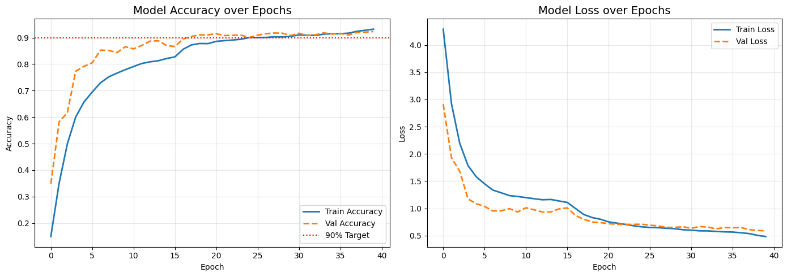

# Bangla Handwriting Recognition with IoT Output

A phone photo of a handwritten Bangla character is sent to a web app, classified by a CNN, and the result is pushed over MQTT to an ESP32 that shows it on an OLED and lights an LED.

Built as an IoT course submission.

## How it works

```
Phone camera -> Flask web app (laptop) -> CNN model -> MQTT (Mosquitto) -> ESP32 (OLED + LED)
```

1. Open the web app on a phone (same WiFi or hotspot as the laptop) and take a photo of one character.
2. `preprocess_bangla.py` cleans the photo: removes shadows, thresholds, crops the character, pads to a square, thickens strokes, resizes to 64x64.
3. The CNN predicts one of 50 BanglaLekha classes.
4. The web app publishes `{idx, conf, ok}` to the MQTT topic `bangla/result`.
5. The ESP32 subscribes, shows the result on the OLED, and turns the LED on when `ok` is true. Otherwise it shows "RETAKE!".

## Model

The CNN was trained earlier by me in a separate machine learning course project and is reused here as the recognition engine.

- Dataset: BanglaLekha-Isolated, classes 1 to 50, 500 images per class (not included in this repo, download it from the official source)
- Architecture: 4 conv blocks (32, 64, 128, 256 filters) with BatchNorm and MaxPool, then Dense 512 with Dropout, 50-way softmax. About 2.5 million parameters, with rotation, translation and zoom augmentation during training
- Input: 64x64 grayscale, raw pixel values 0 to 255 (do not divide by 255), white character on black background
- Test accuracy on the dataset: 91.60% (macro F1 0.916), versus 12.83% for a simple MLP baseline
- Class index `i` corresponds to BanglaLekha folder `i+1`
- Training notebook: `notebook/DLProject_Final.ipynb`
- Full details, training curves, confusion matrix and error analysis: [docs/MODEL.md](docs/MODEL.md)



### Honest limitations

- On noisy images the model is brittle (13.23% accuracy in a noise test), so photo preprocessing matters a lot.
- Accuracy on real phone photos is different from the dataset accuracy. Early check: 2 out of 4 characters correct. A fuller test on the demo set is still in progress.
- Softmax confidence is overconfident. On the test set wrong predictions average 0.71 confidence versus 0.97 for correct ones, so the threshold helps, but a wrong answer can still show 96% confidence on a real photo. `ok = true` means "the model is sure", not "the answer is correct".

## Demo set and accept rule

The demo uses a closed set of 10 characters: ক খ গ জ ত দ ল র ও ঃ

A prediction is accepted only if the top class is inside the demo set, confidence is at least 60%, and the gap to the second class is at least 25%. Otherwise the device shows "RETAKE!".

## Repo layout

```
model/       trained Keras model (bangla_cnn_model_final.keras)
notebook/    training notebook
webapp/      Flask app, preprocessing, requirements
firmware/    ESP32 Arduino sketch (bangla_1)
docs/        report and demo material
```

## Running the web app

Python 3.12 is recommended.

```
cd webapp
python -m pip install -r requirements.txt
python app.py
```

Open `http://<laptop-ip>:5000` on the phone. By default the app connects to an MQTT broker on `localhost`. To use another broker:

```
$env:MQTT_HOST = "192.168.x.x"     # PowerShell
python app.py
```

If no broker is reachable, the app still works and just does not send to the ESP32.

Install Mosquitto on the laptop and allow Python and Mosquitto through the Windows firewall (private network).

## ESP32 firmware

Hardware: ESP32, 1.3 inch SH1106 OLED (128x64, I2C address 0x3C), LED, push button.

| Part | ESP32 pin |
|---|---|
| OLED SDA | GPIO 21 |
| OLED SCL | GPIO 22 |
| LED | GPIO 25 |
| Button | GPIO 4 |

Arduino libraries: PubSubClient, ArduinoJson, Adafruit GFX, Adafruit SH110X (set `USE_SH1106 0` in the sketch for an SSD1306 screen).

Setup:

1. In `firmware/bangla_1/`, copy `secrets.example.h` to `secrets.h`.
2. Fill in your WiFi name, password and the laptop IP running Mosquitto.
3. Open `bangla_1.ino`, select the ESP32 Dev Module board and upload.

`secrets.h` is ignored by git and must never be committed.

The button publishes `click` to `bangla/capture`. The web app does not listen to it yet.

## Status

- Working: phone photo to prediction, MQTT publish, ESP32 receives and shows result, LED feedback
- In progress: accuracy test of the 10 demo characters on real photos, showing all 10 character names on the OLED (currently only ক and খ have names in firmware)
- Planned: Bangla glyph bitmaps on the OLED

## License

Add a license of your choice before sharing widely.
