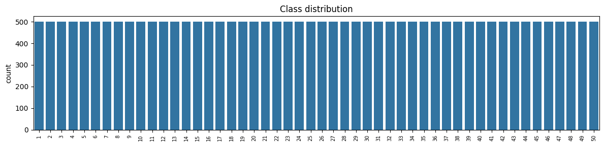
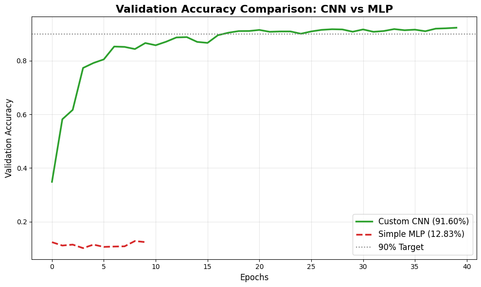
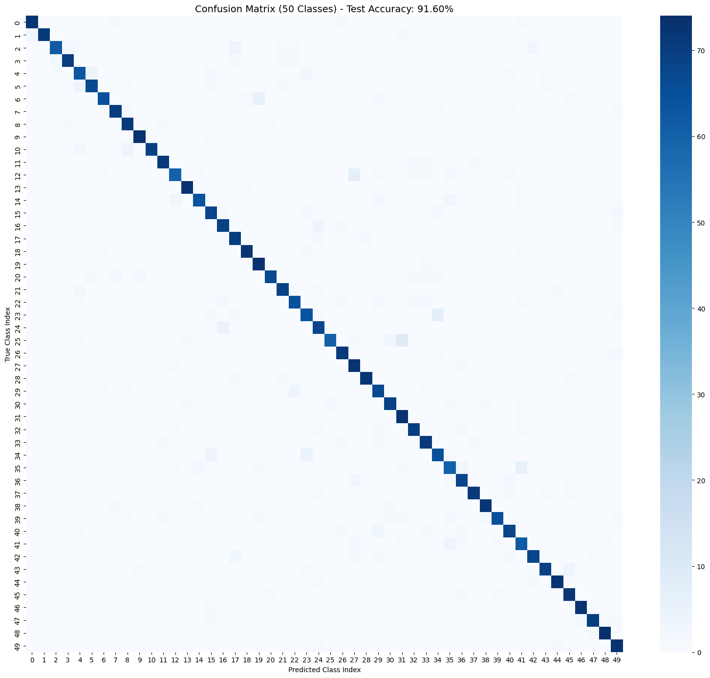
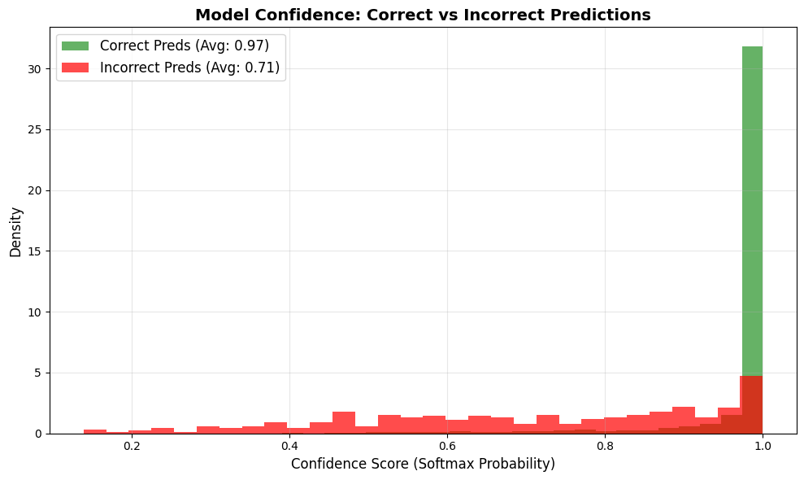

# CNN Model for Bangla Character Recognition

This page describes the deep learning model used in the project. The model was trained earlier in a separate machine learning course project and is reused here for the IoT demo. Full training code and outputs are in `notebook/DLProject_Final.ipynb`.

## Dataset

- BanglaLekha-Isolated, folders 1 to 50 (the 50 basic characters: vowels, consonants, modifiers). The dataset itself is not included in this repo, please download it from its official source.
- 500 images per class, 25,000 images in total, randomly sampled with seed 42
- Each image converted to grayscale and resized to 64x64
- Stratified split: 70% train (17,500), 15% validation (3,750), 15% test (3,750), which is 75 test images per class

## Architecture

Sequential CNN with 2,513,074 parameters (about 9.6 MB in memory).

| Stage | Layers |
|---|---|
| Augmentation (training only) | RandomRotation(0.1), RandomTranslation(0.1, 0.1), RandomZoom(0.1). No flips, because mirrored Bangla characters are different shapes |
| Conv block 1 | Conv2D 32 (3x3, same, ReLU), BatchNorm, MaxPool 2x2 |
| Conv block 2 | Conv2D 64 (3x3, same, ReLU), BatchNorm, MaxPool 2x2 |
| Conv block 3 | Conv2D 128 (3x3, same, ReLU), BatchNorm, MaxPool 2x2 |
| Conv block 4 | Conv2D 256 (3x3, same, ReLU), BatchNorm, MaxPool 2x2 |
| Classifier | Flatten, Dense 512 (ReLU, L2 0.001), Dropout 0.5, Dense 50 (softmax) |

Input: 64x64x1, raw pixel values 0 to 255 (no division by 255), white character on black background.

## Training

- Optimizer: Adam, loss: sparse categorical cross-entropy
- Batch size 128, up to 40 epochs
- Callbacks: EarlyStopping on validation accuracy (patience 7, restore best weights), ReduceLROnPlateau (factor 0.4, patience 3), ModelCheckpoint
- Framework: TensorFlow 2.20 on a Colab GPU
- Final validation accuracy: 92.29%

## Results on the test set

| Metric | Custom CNN | Simple MLP baseline |
|---|---|---|
| Test accuracy | 91.60% | 12.83% |
| Macro precision | 0.9178 | 0.1997 |
| Macro recall | 0.9160 | 0.1301 |
| Macro F1 | 0.9160 | 0.1207 |
| Parameters | 2,513,074 | see notebook |

The MLP baseline (two dense layers on flattened pixels, 10 epochs) barely learns, which shows that convolutional features matter for this task.

### Error analysis

- Hardest classes by F1: class 35 (0.805), 41 (0.821), 4 (0.840), 12 (0.845), 23 (0.848)
- Most confused pairs (true -> predicted, count): 25 -> 31 (9), 12 -> 27 (7), 23 -> 34 (7), 6 -> 19 (6), 35 -> 41 (6)
- Class index `i` is BanglaLekha folder `i+1`. In the character order used by this project (অ আ ই ঈ উ ঊ ঋ এ ঐ ও ঔ ক খ গ ঘ ...), class 12 is খ and class 27 is থ

### Confidence behaviour

On the test set the average softmax confidence is 0.97 for correct predictions and 0.71 for wrong ones, so a confidence threshold does filter many mistakes. But a visible tail of wrong predictions still has confidence above 0.9, so high confidence is not a guarantee of correctness.

## Known limitations

- **Noise sensitivity.** Adding Gaussian noise (sigma 0.1 of the pixel range) drops accuracy from 91.60% to 13.23%. The training augmentation covers geometry only, not noise, blur or lighting changes.
- **Domain gap.** The model was trained on clean scanned characters. Phone photos have shadows, uneven lighting and different pen thickness, which is why the web app runs a preprocessing pipeline (shadow removal, threshold, crop, square pad, stroke thickening) before prediction.
- **Real photo accuracy is not the same as dataset accuracy.** A quick early check on 4 real photos gave 2 correct. A systematic test on the 10 demo characters is in progress, and the result will be added here.
- **Overconfidence.** See the confidence section above.

## Reproducing

1. Download BanglaLekha-Isolated and put it where the notebook expects it (the notebook was written for Google Colab with the zip on Google Drive, so adjust the paths if you run it elsewhere).
2. Run `notebook/DLProject_Final.ipynb` from top to bottom.
3. The notebook saves the model as `bangla_cnn_model_final.keras`, the same file stored in `model/`.
